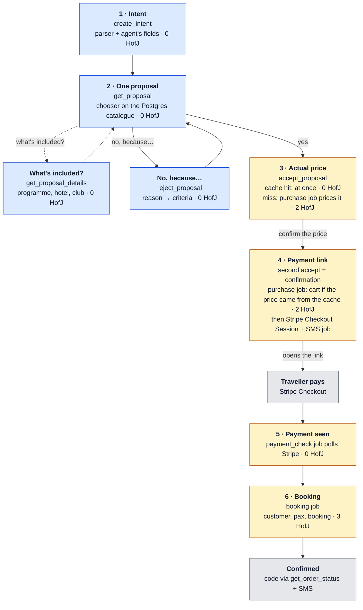

# Vela — Architecture

This document explains how Vela is built, the choices behind it, and what each choice cost. It
is written for readers who have not followed the project day to day. Every decision here is
recorded in more detail, with date and rejected alternatives, in [`docs/decisions.md`](docs/decisions.md)
(Italian); section names below refer to its headings. Load test numbers come from
[`loadtest/RESULTS.md`](loadtest/RESULTS.md).

Labels used for numbers: **measured** = from a real call, the fake HofJ's call log, or Locust;
**projected** = computed from measured rates by `loadtest/projection.py`; **predicted** = a
reasoned estimate never confirmed by a run.

---

## 1. What Vela is

Vela has no homepage. A traveller says one sentence ("a padel weekend in Spain in October, two
of us, max 800 euro") to the assistant they already use: Claude through MCP, an ElevenLabs voice
agent, or any REST client. Vela answers with **one** trip at a time, never a list. Every "no,
because…" produces another single proposal. A "yes" leads to the actual price, a Stripe payment
link, and a real booking code from the House of Journeys (HofJ) API.

Two consequences shape everything else:

- **The traveller's agent does the talking; Vela does the deciding.** Vela is a service with
  tools, not a chat UI. Every response carries a `say` field: one sentence, in the traveller's
  language, written to be read aloud, with no markdown and no URL spelled out. This is what
  makes the same service work for a screen, a voice call and a phone line.
- **Browsing is free, buying is scarce.** Understanding the intent and choosing a trip never
  call HofJ. Only buying does, and HofJ allows 120 calls a minute per key. The whole
  architecture is organised around spending those calls well.

## 2. The system at a glance

```
  Claude (MCP)   ElevenLabs agent / phone (MCP)   REST client        landing/ (static site:
        \                 |                          /                a guide to the channels)
   vela/surfaces/   mcp.py (6 tools)   rest.py (/v1, bearer)   health.py   checkout_pages.py
                                       |
   vela/domain/     use cases: create_intent, get_proposal, get_proposal_details,
                    reject_proposal, accept_proposal, get_order_status
                    intent + refine (parser it/en), chooser, geo, labels, say
                    orders, quotes (price cache), quota (token bucket rules)
                    jobs: purchase, payment_check, booking, sms
                                       |
   vela/ports/      HofJPort, HofJRouter, PaymentsPort, Notifier, IntentExtractor,
                    CatalogSource, QuotaStore, JobRepository, repositories
                                       |
   vela/adapters/   hofj_http (one client per brand) | hofj_replay
                    stripe_links (Checkout Session)  | stripe_fake
                    twilio SMS | fake SMS    haiku    repo_postgres | repo_memory
                    worker threads (same process)    catalogue sync thread (live)
                                       |
                    Postgres: catalogue, intents, proposals, rejections, orders,
                              jobs (the queue), quota bucket, price quotes
```

- **One process** (FastAPI on Render) serves REST, MCP, `/health`, the two static checkout
  return pages, the worker threads and the sync thread. **All state is in Postgres**, so any
  instance can serve any request and more instances need no configuration.
- **Three upstream modes.** `replay` (default; HofJ from recorded fixtures), `live` (real HofJ,
  one client per brand), `loadtest` (HofJ over HTTP to a local fake only; refuses any other
  host). Payments and SMS are chosen independently: a Stripe key gives a real Checkout Session,
  three Twilio variables give real SMS; otherwise both are fakes.

### The purchase funnel: who serves each step

Every step starts from the traveller's agent (Claude, the ElevenLabs agent, a REST client) calling
one of Vela's tools. What differs is who does the work: Vela inside the request, Vela's worker
through the queue in Postgres, or a service outside Vela. Each box shows the HofJ calls it spends.



Blue = answered by Vela inside the request (no queue, no HofJ). Amber = work done by Vela's
worker threads, queued in Postgres and paced by the quota bucket. Grey = outside Vela (Stripe's
page, and the code delivered to the traveller).

| Stage | The traveller's agent asks | Who serves it | HofJ calls | What happens here under peak |
|---|---|---|---|---|
| 1 · Intent | `create_intent` | Vela, in the request: structured fields, then the it/en parser, then Haiku if configured | 0 | Nothing waits. A missing sport becomes one question |
| 2 · Proposal, details, rejection | `get_proposal`, `get_proposal_details`, `reject_proposal` | Vela, in the request: chooser and details on the catalogue copy in Postgres | 0 | Nothing waits for HofJ. Most travellers stop here: browsing is free |
| 3 · Actual price | `accept_proposal` | Cache hit: Vela in the request. Miss: the purchase job of the first order for that price key (the leader); identical orders attach to it | 0 on a hit, 2 per price key | Accept waits up to 100 s. With the queue full the traveller hears a position and a declared wait |
| 4 · Link | `accept_proposal` again (the confirmation) | Purchase job: creates the cart if the price came from the cache and checks the total again; then Stripe Checkout Session, SMS job (Twilio) | 2 (0 for the leader, who already has the cart) | **The wait that grows**: FIFO under the token bucket, declared, no cap. Silent orders expire after 15 min. A changed total goes back to step 3 |
| 5 · Payment | `get_order_status` (optional) | Stripe (payment page); `payment_check` job reads the session every 60 s or when asked | 0 | Up to 60 s unless the traveller asks |
| 6 · Booking | `get_order_status` | Booking job, quota class `booking`: may drain the bucket, never queues behind purchases | 3 | Never sacrificed |

### The path of a purchase, step by step

| Step | What happens | HofJ calls |
|---|---|---|
| 1 | `create_intent`: parse the sentence (or take the agent's structured fields); ask "padel or tennis?" if the sport is missing | 0 |
| 2 | `get_proposal`: the chooser reads the catalogue **from Postgres** and returns one trip with a "from" price and its reasons | 0 |
| 3 | `get_proposal_details` (optional, any time): "what's included?" → the day-by-day programme, hotel, club, playing hours, from the product details the sync already stored. Read-only: no state change, works on a rejected proposal too | 0 |
| 4 | `reject_proposal`: the reason becomes criteria ("too expensive", "somewhere cooler" → north, "not that hotel"); a new single proposal | 0 |
| 5 | `accept_proposal`: create a `queued` order, never call HofJ or Stripe. If the price for the same product, date and party is cached, answer at once with `awaiting_confirmation`; otherwise wait up to 100 s for the purchase job to price it | 0 |
| 6 | Purchase job, on a cache miss: `POST /v1/itineraries` (includes the default hotel, 2–6 s) and `GET` the total → `awaiting_confirmation`, "the actual price is 840 euro for two, confirm?" | 2 |
| 7 | Second `accept_proposal` = confirmation. If the price came from the cache, the purchase job now creates the cart and reads the total (a different total goes back to step 6's question). Then Stripe Checkout Session → `awaiting_payment`, link read via `get_order_status` (and by SMS) | 2 on a cache hit, else 0 |
| 8 | `payment_check` job reads the Checkout Session every 60 s and whenever the traveller asks | 0 |
| 9 | Booking job: `PUT customer`, `PUT pax`, `POST /v1/bookings` with the PaymentIntent → `confirmed`, code by status and SMS | 3 |

---

## 3. Decisions and trade-offs

Each entry: what we chose, what we rejected, what it costs, and where the evidence is.

### 3.1 No interface of our own; surfaces are thin adapters

- **Choice.** A core service with no UI, reached through MCP and REST. The MCP server is
  Streamable HTTP, **stateless**, with JSON responses. REST is RFC 7807 with a `say` on errors
  too, and fails closed (503) when no token is configured. A sixth, read-only use case,
  `get_proposal_details`, answers "what's included?" without turning the proposal into a
  brochure. The only web pages are Stripe Checkout, two static return pages that show no order
  data, and a landing page that explains how to reach Vela (Claude connector, voice, phone) and
  shows no trips.
- **Rejected.** A web front end (it would be the marketplace the brief forbids). Putting details
  inside `get_proposal` (too long to read aloud). A landing page as a showcase of trips.
- **Trade-off.** The quality of the conversation depends on someone else's agent. We compensate
  with tool descriptions written for a model talking to a human by voice, ready-made `say`
  sentences, and structured fields (§3.11).
- **Evidence.** `decisions.md`: "Requisiti e architettura di Vela", "M3: superficie MCP", "M4:
  superficie REST", "Dettagli del pacchetto (RF-83)", "Landing: design".

### 3.2 Hexagonal domain, one process, state in Postgres

- **Choice.** Domain and ports never import adapters or surfaces. HofJ, Stripe, SMS and the LLM
  each have a real and a fake adapter, so the whole flow runs in tests and in replay with no
  external call. One deployable process; the background work runs as threads inside it.
- **Rejected.** A separate worker service plus a queue (two deploys to keep in step within 24
  hours). A single synchronous "buy" tool (it would force the whole conversation into one turn).
- **Trade-off.** Background work shares the interpreter and connection pool with the API: after
  raising workers from 4 to 10 the worst REST p95 rose from 30 to 200 ms at 34 req/s
  (**measured**; the cause is a hypothesis, not measured separately). Splitting the worker into
  its own process is a configuration change, not a redesign, because the queue is already in
  Postgres.
- **Evidence.** `decisions.md`: "Requisiti e architettura di Vela"; `RESULTS.md`: "Cosa cambia
  con M18", point 12.

### 3.3 Postgres is the queue

- **Choice.** A `jobs` table; every instance runs `worker_concurrency` threads (10) that claim
  jobs with `FOR UPDATE SKIP LOCKED`, in priority order `booking` → `payment_check` → SMS →
  `purchase`. A job saves each step before the next, so a crash resumes where it stopped; a
  `running` job whose lease (180 s) expires is picked up again by any instance.
- **Rejected.** Redis/Celery (a second service). A single elected drainer (no high availability).
- **Trade-off.** Postgres polling (1 s) is not the fastest queue, but at ~100 HofJ calls a minute
  the queue is never the bottleneck, and jobs, orders and quota change in the same database.
- **Evidence.** `decisions.md`: "Twist: 50.000 viaggiatori in dieci minuti", "M5: HofJ reale,
  coda d'acquisto e scheduler della quota".

### 3.4 Quota: a constant-rate token bucket

- **Choice.** Every HofJ call takes a token from one bucket shared by the cluster in Postgres:
  capacity B = 8, refill r = 100/60 tokens/s, so B + 60·r = 108, which is 120/min minus a 10%
  margin for other uses of the key. **No 60-second interval can contain more than 108 calls,
  whatever window rule HofJ applies.** Purchases and sync take tokens only while at least 3
  remain (the floor); bookings of paid orders may drain the bucket to zero. The sync never runs
  while a purchase is waiting. A job takes all the tokens for its remaining calls or none. A 429
  empties the bucket and triggers exactly one cluster-wide re-read of `GET /v1/quota`.
- **Rejected.** Copying HofJ's window. The first version (M5) did that: a 60 s window aligned to
  HofJ's, advanced by our clock. Also rejected: two buckets (more state, and purchases capped
  even when bookings don't need their share).
- **Why we changed.** A probe (6 calls to `/v1/quota`) **measured** HofJ's window as fixed and
  anchored to the first call after the previous one expires. It is not rolling, as the brief
  and OpenAPI say, and not on a clock grid, as our counter assumed. Our counter drifted from
  HofJ's window. Rather than chase a rule we cannot observe without spending quota, we made the
  rate safe under any rule. The load test confirmed the drift: 132–138 calls in 60 s before,
  105–108 after (§4.5).
- **Trade-off.** A constant rate gives up bursts. At an empty queue the first traveller can wait
  slightly longer (Marco confirmed at 95 s instead of 75 s in the 500-traveller run).
- **Evidence.** `decisions.md`: "M18: quota a ritmo costante", "Twist, seconda lettura";
  [`docs/api/quota-health.md`](docs/api/quota-health.md).

### 3.5 Accepting is asynchronous; the price is confirmed before the link

- **Choice.** `accept_proposal` never calls HofJ or Stripe. It creates a queued order with a
  position and a declared wait (position × 60 s ÷ purchases per minute, **no cap**: a two-hour
  wait is said, not refused), then waits up to 100 s for the purchase job to price it. The
  proposal price is always "from"; the actual total is read from the itinerary and
  must be confirmed with a second accept before a link exists.
- **Why the wait inside accept.** The MCP server is stateless and cannot wake the agent: if
  accept answered "queued" at once, the agent would have to remember to ask again. 100 s stays
  under ElevenLabs' 120 s tool timeout.
- **Rejected.** A synchronous accept that does the cart calls when budget is free (two code
  paths, 10–30 s requests, and the path used under peak would not be the one tested). Showing
  the real price in the proposal (2 calls and 2–6 s for every proposal, including rejected
  ones). Refusing long waits and asking to retry later (it turns the peak into repeated
  errors). A 10 s wait only for the first in line (M20): superseded by the price confirmation.
- **Trade-off.** Each waiting accept holds a thread (pool of 40) for up to 100 s. An
  `awaiting_confirmation` order has no expiry, and a refused price leaves an orphan cart on
  HofJ.
- **Evidence.** `decisions.md`: "Twist: 50.000 viaggiatori…", "Prezzo effettivo prima del link",
  "M20 assorbita dalla conferma del prezzo". The case that triggered it: an estimate of 656 €
  and a link of 840 €.

### 3.6 Spend calls on the travellers who will pay

Before this change every accept cost 5 HofJ calls before we knew whether the traveller would
pay (look-to-book). Two changes moved the calls to where they buy something.

- **Link with 2 calls, booking with 3 (M19).** The total depends only on product, date, adults
  and rooms, fixed at itinerary creation. Customer and passengers therefore move after payment,
  into the booking job. Queued orders with no sign of life for 15 minutes expire with 0 calls.
  **Measured** on staging before building it: the total does not change after customer and
  pax, and `PUT customer`/`PUT pax` are accepted after a test payment.
  - *Trade-off:* in production a 4xx on those PUTs after payment would mean a failed booking
    and a manual refund. The question is open with HofJ (question 10).
- **Price cache with fanout (RF-84).** Only the price is shared, keyed on product, date,
  adults, rooms and currency, in a Postgres table with a 900 s TTL. The first accept for a key
  becomes the leader and prices it; identical accepts attach to the leader instead of queueing
  their own cart.
  - *Rejected:* Redis (a new service, no shared transaction with orders), a per-process cache
    (not shared across instances), cache only (everyone misses at the peak), fanout only (the
    price does not outlive the peak).
  - *Trade-off:* a cache hit has no cart, so an unbookable product is discovered only after the
    "yes". A stale price costs one more confirmation round.
- **Deliberate choice: the total is read again before every link, even after a cache hit.**
  - *Why:* `POST /v1/itineraries` returns only the itinerary id, so the amount to pay can be
    read only with `GET /v1/itineraries/{id}`, and the link always carries the cart's total.
    The cache key matches the cart exactly, so the risk is time: within the 15-minute TTL HofJ
    can change the price or the default hotel, and this read is the only check before the
    traveller pays.
  - *Rejected:* a 1-call link for cache hits, with the read moved into the booking job. It
    would give ~90 links/min instead of 47 at 2% payers and drain 50,000 travellers in ~1.8 h
    instead of ~3.5 h (**predicted**). The cost: a changed price would be found only after
    payment, meaning a failed booking and a manual refund.
  - *Reopen if* HofJ returns the checkout in the `POST` response, or if `live` runs show that
    prices almost never change after a cache hit (`quote_price_changed` log lines).
- **Result (measured, 2,500 travellers).** With the cache, 473 of 487 accepts heard the actual
  price at once. After M19, links per minute went from 17.8 to **47.4** on the same ~100
  calls/min: 2.11 calls per link, 3.00 per booking. *Not like-for-like:* the M19 run had 2% of
  travellers paying against 60% before; at 60% the estimate is ~26 links/min (**predicted**, run
  not done).
- **Evidence.** `decisions.md`: "M19 passo 1", "M19 passo 2: decisioni approvate", "Cache del
  prezzo con fanout (RF-84)", "Link a 2 chiamate: la GET del totale resta (scelta deliberata)"
  (on branch `task/m19`, not yet on `master`); [`docs/api/customer-pax.md`](docs/api/customer-pax.md).

### 3.7 A timeout is an uncertain outcome

- **Choice.** HofJ gives up towards the brand after 15 s, but the brand may have finished the
  work. We retry only what is idempotent. `POST /v1/bookings` is an upsert on `itineraryId`, so
  it is retried freely (§4.4). `POST /v1/itineraries` is not, so a timeout there is counted as
  a probable orphan itinerary (`orders.orphan_itineraries`, visible in `/health`). Our client
  waits 20 s, longer than HofJ's 15 s, so we receive HofJ's own "brand timed out" instead of
  cutting it off.
- **Measured bug, then fixed.** With 10 workers the load test found duplicate booking POSTs
  *without* any fault (1–6 per run). Two concurrent `mark_paid` calls each queued a booking job,
  because "is there already an active job?" was not atomic. The HofJ upsert made them harmless,
  but each cost a token. Fix: an atomic status transition (`save_if_status`) plus a partial
  unique index on active booking jobs; a rerun measured 0 duplicates.
  - *Rejected:* `SELECT … FOR UPDATE` across repositories (a transaction shared between
    repositories changes the architecture).
- **Evidence.** `decisions.md`: "M18: quota a ritmo costante", "Un solo job di prenotazione per
  ordine (task/booking-race)"; `RESULTS.md`: "Dopo il fix delle prenotazioni doppie".

### 3.8 Payment through HofJ's Stripe account, without a webhook

- **Choice.** One Stripe Checkout Session per order: it expires after 24 h, and a deterministic
  idempotency key means a retry cannot create a second payable link. The session is created on
  HofJ's Stripe account, for `openAmount` (what HofJ says is still to pay, not `total`). We
  learn about the payment by **polling** the session (every 60 s and on every status request),
  then forward the PaymentIntent to `POST /v1/bookings`.
- **Rejected.** A signed webhook. We built it, then removed it on HofJ's instruction to close
  payment through their API only. Payment Links (they don't expire). A Stripe.js page on HofJ's
  own PaymentIntent (a large change needing a publishable key).
- **Trade-off.** Up to 60 s between payment and booking unless the traveller asks. We never call
  the booking blindly, because staging answers 200 even for an unpaid cart.
- **Evidence.** `decisions.md`: "M6: Stripe, link di pagamento e webhook", "M5: seconda sonda sul
  pagamento", "M5: pagamento senza webhook"; [`docs/api/internal-checkout.md`](docs/api/internal-checkout.md).

### 3.9 The catalogue is a copy, synced per brand

- **Choice.** No traveller request searches HofJ. A sync job copies padel (Weebora) and tennis
  (Terrarossa) products into one Postgres table (`HOFJ_BRANDS` maps sport to brand), fetching
  details only for new or changed products. It runs at boot if the catalogue is stale, then
  every 6 hours, under an advisory lock, and pauses while purchases wait. A brand whose sync
  fails archives nothing. The HofJ id stays the primary key, with a `brand` column; the cart
  always uses the product's brand, re-read from the database on every job run.
- **Rejected.** Searching HofJ live (quota). One variable per sport, or JSON config. A composite
  key or prefixed ids (would touch four tables or change public ids).
- **Trade-off.** The proposal price can be hours old, which is why it is "from" and the actual
  price is confirmed (§3.5). A product that fails at the cart is marked unbookable for 24 hours,
  and the traveller receives a replacement proposal without seeing an error. Event packages and
  tournaments are excluded: watching a final is not a trip to play.
- **Evidence.** `decisions.md`: "M10: sync multi-brand del catalogo", "M10: design del sync",
  "M10: pacchetti evento esclusi".

### 3.10 Choosing one trip

- **Choice.**
  - A deterministic Italian/English parser, with the agent's structured fields taking
    precedence. Claude Haiku is used only as a fallback when a key exists, and it only fills
    empty fields.
  - The chooser applies hard filters: bookable, a real trip, sport, dates, party size, rooms,
    rejected products. Softer wishes only **sort** and never exclude: area (city > region >
    country), budget, duration, level, lessons. When a wish cannot be met, the reason says so
    ("no dates in Lanzarote: this one is in Tenerife").
  - "Too expensive" caps the next price below the one rejected.
  - Near-identical products (same hotel, title and destination, within 5% of price) count as one candidate.
  - A refusal reason is interpreted before anything is written; if it can't be classified, Vela
    asks one closed question.
- **Rejected.** Price-only ordering (it would propose Italy to someone asking for Spain).
  Soft criteria as exclusions: with a small catalogue and uncertain data they would produce
  frequent "nothing compatible". Asking "what matters most?" on mixed refusals.
- **Trade-off.** Level and lesson labels come from text rules, with known false positives and
  negatives. "Cooler" and "warmer" use latitude, because the catalogue has no climate data.
- **Evidence.** `decisions.md`: "M11: chooser v2", "Scelta v3 (M21)", "M21-A" … "M21-F"; spec
  [`docs/usecases/scelta.md`](docs/usecases/scelta.md).

### 3.11 The agent–tool contract

- **What went wrong.** In claude.ai a traveller said "too hot, somewhere cooler". The agent
  "rephrased" by calling `create_intent` again instead of `reject_proposal`. The new intent had
  no rejections, the chooser is deterministic, and the same trip came back.
- **Choice.** `create_intent` and `reject_proposal` accept optional structured fields (sport,
  area, period, pax, budget, rooms, direction) on MCP and REST alike. Precedence is field >
  parser > Haiku. Every `say` repeats what was understood, so a wrong field can be heard and
  corrected. Tool descriptions say that every change after a proposal goes through
  `reject_proposal`. The sport is always required, and "either" is a valid answer.
- **Rejected.** Making `sport` mandatory in the schema (the agent would guess instead of asking).
- **Evidence.** `decisions.md`: "Contratto tra l'agente e i tool MCP";
  [`docs/usecases/agente-tool.md`](docs/usecases/agente-tool.md).

### 3.12 SMS as queue jobs

- **Choice.** Two SMS through Twilio's HTTP API: the payment link and the booking code. They are
  jobs in the same queue, retried up to 4 times, and they never change an order's state. Vela
  promises SMS only when Twilio is really configured.
- **Rejected.** Sending from inside the purchase and booking jobs (a failed SMS would slow or
  repeat a purchase). The Twilio SDK (a dependency for one HTTP call).
- **Trade-off.** A rare duplicate SMS is accepted.
- **Evidence.** `decisions.md`: "SMS: design delle notifiche"; [`docs/sms.md`](docs/sms.md).

### 3.13 Hotel choice: designed, probed, not built

- **Design.** One alternative hotel at most, in a quota class below purchases, all tokens or
  none, only with an empty purchase queue.
- **Verdict (measured).** A staging probe never found a hotel that `PATCH …/accommodations`
  could take. The list exists only for products with `allowAccommodationList` (8 of 126 in
  production). We did not build it. The hotel is the one included in the trip; a traveller who
  refuses it gets another trip without that hotel.
- **Evidence.** `decisions.md`: "M22-a: scelta dell'hotel con degrado dinamico";
  [`docs/plans/2026-09-27-m22-hotel.md`](docs/plans/2026-09-27-m22-hotel.md) (design and reopen
  conditions).

---

## 4. The twist: 50,000 travellers in ten minutes

The twist: a distribution deal brings 50,000 travellers in a ten-minute window.
- HofJ's quota is per client and documented as "rolling 60-second", with no `Retry-After` or
  `RateLimit-*` headers; `GET /v1/quota` spends the same budget.
- Upstream calls time out at 15 s, and the accommodation search in the purchase flow takes
  2–6 s.
- "Your prototype must still take a booking at minute six."
- The load test must hit our edge, never the real API.

The five asks, one per subsection.

### 4.1 The architecture that holds, and the diff in our thinking

**What holds.** The conversation (intent, proposal, rejection, details) spends no HofJ call. It
reads Postgres, and stayed under 220 ms p95 in every run, up to the highest load we generated
(34 req/s on one instance). Beyond that it scales by adding instances, which we have not measured
(§4.5). The purchase
is capped by physics: ~100 HofJ calls a minute. The design turns that cap into a **declared
wait** instead of errors:
- a queue in Postgres;
- one quota bucket for the cluster;
- priority for bookings of paid orders;
- calls spent only on travellers who confirm the price and pay.

**How our thinking changed**, in three moments:

1. **Before the twist.** Quota was an error to handle: a synchronous accept within 30 s, and
   "try again in a minute" when the quota ran out.
2. **First reading.** Quota is capacity to plan: a queue in Postgres, one scheduler for the
   cluster, an always-asynchronous accept with a declared wait, a reserve for bookings, no cap
   on the wait.
3. **Second reading and measurement.** The structure held; six ideas changed:

| We thought | We now think | What changed our mind |
|---|---|---|
| Copy HofJ's window and align to it | Be safe under any window: constant rate | The brief says "rolling", the probe measured an anchored window, our counter used a grid. HofJ can't be observed for free |
| The limit is the quota | The limit can be latency | 5 serial calls of 2–6 s: with 4 workers and pessimistic latency, ~10 purchases/min instead of 17.4 (measured). 10 workers restored 16.0 |
| A timeout is an error: retry | A timeout is an uncertain outcome: retry only what is idempotent | The 15 s timeout. The booking upsert is safe; the itinerary is not (orphans) |
| Spend calls in arrival order | Spend calls on who pays | Look-to-book: 5 calls for a link nobody may pay. Now 2 per link, 3 after payment |
| The price comes with the link | The price is confirmed first, and shared | The 656 € vs 840 € case; identical accepts at the peak (473 of 487 cache hits) |
| The load test measures performance | The load test proves a boundary | "Never against HofJ"; the fake must apply HofJ's rules, not ours, or the test passes by construction |

What did not change: queue in Postgres, a single asynchronous accept path, priority for paid
bookings, no extra service.

**A wrong assumption, corrected.** We first proposed the token bucket because we took the brief's
"rolling" window at face value. The probe disproved it. The bucket stayed, for a better reason:
our own counter drifted, and a constant rate is safe whatever HofJ does.

### 4.2 Quota budget: browse, cart, hotel, booking

120 calls/min per key, padel and tennis together. The 10% margin gives 108. Bucket B = 8,
r = 100/min.

| Brief item | HofJ calls | Quota class | Notes |
|---|---|---|---|
| Browse (intent, proposal, rejection, details) | 0 | — | Catalogue in Postgres |
| Cart | 2 per link: create itinerary, read total | `purchase` | Once per price key thanks to the cache; retries only on network/5xx, at most 3, ≥ 60 s apart |
| Hotel | Inside `POST /v1/itineraries` (default hotel) | `purchase` | The 2–6 s call. No call to `/accommodations`: hotel change designed and probed, not built (§3.13) |
| Booking | 3 per paid order: customer, pax, booking | `booking` | May drain the bucket to 0; never waits behind purchases |
| Quota read | 1 at boot and after a 429 | `booking` | Never in a loop |
| Payment check | 0 | — | Reads Stripe |
| Catalogue sync | pages + changed details of two brands, every 6 h | `sync` | Only when no purchase is waiting |

**What we sacrifice, in order:**
1. the catalogue sync;
2. the wait for the link, which grows, is declared and has no cap;
3. never the booking of an order already paid.

With a 5% expected paying share, the declared wait assumes ~46.5 links/min.

### 4.3 What degrades and what never does: minute six

- **Marco** accepts at minute 1. He hears the actual price within seconds, because it is cached
  or priced by the leader. He gets the link when his turn comes, pays, and his booking jumps
  the queue: **5 s from payment to confirmation** in every run without faults (measured; 30 s
  when a fault hit his own booking call).
- **Anna** arrives in the middle of the peak. She gets her proposal in 10–15 ms, "too
  expensive" gets her another one, and after "yes" she hears the price and an honest wait. She
  never sees an error or a timeout, and can give up at any point with `reject_proposal`.

What we measured and what we projected:

| | Measured, 2,500 travellers in 5 min (after M19) | Projected, 50,000 in 10 min (after M19) |
|---|---|---|
| Anna's proposal | 15 ms, at a peak of 34 req/s | not measured: the conversation would reach ~420 req/s (§4.5) |
| Marco: link / confirmed | 90 s / 95 s | link after ~20 min |
| Anna: wait for the link | link at 332 s (she arrived at 180 s) | ~121 min |
| Last traveller | — | ~201 min; queue drained in 3.5 h |

- **What degrades:** only the wait for the link, and it is declared. Our first prediction, "Marco
  gets the link around minute 3", is **refuted** at 10,000 and 50,000 travellers: with ~1,000
  accepts a minute he has hundreds of people ahead of him.
- **What never degrades:** the confirmation of whoever has already paid, and the conversation's
  use of HofJ, which stays at 0 calls at any load. Its response time we have measured only up to
  34 req/s on one instance (worst p95 220 ms, 0 errors). At 50,000 travellers it depends on
  running enough instances (§4.5).

### 4.4 `POST /v1/bookings` is an idempotent upsert on `itineraryId`

A second POST for the same itinerary returns the same booking instead of creating another. We
rely on it in three places:

1. **`BookingJob.run`** (`vela/domain/booking.py`). On network error, timeout or 5xx it repeats
   the same POST for the same itinerary: 5 attempts, 5/10/20/40 s apart. A 4xx is not repeated;
   a 429 waits for tokens without counting as an attempt.
2. **Expired lease.** A booking job still `running` after 180 s (for example on a crashed
   instance) is claimed again by another worker and the POST is sent again.
3. **Two jobs for one order.** This was possible until the load test found it (§3.7). It is now
   prevented by the atomic transition and the unique index, and the upsert remains the safety
   net.

Measured with faults (`hang_then_execute` on 5% of booking calls): repeated POSTs, **one**
booking per itinerary every time.

**Where we cannot rely on it.** `POST /v1/itineraries` is not idempotent. A retry after a timeout
creates a second itinerary and the first is orphaned (3 in the faults run, now counted). We asked
HofJ for a client reference to look an itinerary up after a timeout, as Expedia's
`affiliate_reference_id` allows (question 9).

### 4.5 The load test

**What it proves.** A boundary: **HofJ calls per minute stay flat and under 108 however many
travellers arrive**, while only the declared wait grows.

**Never against HofJ.** Not even through Render: the deployed service is in `live` mode on HofJ
staging. Against the real API we could not provoke timeouts or see the window, latency would
change run to run, and evaluators could not repeat it without our key.

**How it works.**
- **Fake HofJ that applies HofJ's rules, not ours:**
  - 120/min per key, with an anchored window by default (as measured) or `rolling`;
  - 12/min of background traffic on the same key;
  - 2–6 s on itinerary creation and 0.3–1.5 s elsewhere (**predicted** latencies);
  - injectable faults: hang then execute, hang, 5xx, product 502;
  - a JSONL log of every call. **All checks run on the fake's log, not on Vela's.**
- **`loadtest` mode.** Vela refuses any host other than localhost/`fake-hofj`, and payments and
  SMS are fake.
- **Scenario.** An open-model Locust scenario with seed 13: 30% say "too expensive", 20%
  accept, status is polled every 30–60 s, 60% of link holders pay. Two sentinels, Marco and
  Anna.

**Run it** (Docker only, no keys):

```sh
docker compose up -d --build
docker compose run --rm locust --travelers 2500 --label 2500 --duration 8 --arrival-minutes 5 --tail-minutes 3
docker compose down -v          # each run starts from a clean DB, queue and quota
python loadtest/projection.py --rate 47.4   # project a measured rate to the twist
```

Details, options and fault injection: [`loadtest/README.md`](loadtest/README.md).

**Pass criteria.** A failure is reported with its number, never fixed by changing the test:
- 0 × 429;
- ≤ 108 Vela→HofJ calls in any 60 s;
- Marco confirmed by minute 7;
- one booking per itinerary.

The queue saturates at 500 travellers in 5 minutes, so the runs use 500–2,500 travellers and the
twist numbers are projected.

**Numbers per round** (run C: 2,500 travellers in 5 min + 3 min tail, anchored window,
standard latency; all **measured**):

| | Before (M13a) | After M18 bucket (M13b) | After booking-race fix | After price cache | After M19 (2% pay) |
|---|---|---|---|---|---|
| Max Vela→HofJ calls in any 60 s | **138** ❌ | 106 | 106 | 106 | 104 |
| 429 received | 0 | 0 | 0 | 0 | 0 |
| Vela calls/min at steady state | 92 (bursty) | 99 (flat) | — | 99 | 100 |
| Links/min | 16.3 | 17.8 | — | 17.8 | **47.4** |
| Accepts / links / confirmed | 487 / 127 / 73 | 487 / 135 / 74 | 487 / 135 / 75 | 487 / 127 / 72 | 487 / 328 / 14 |
| Itineraries with a repeated booking POST | 0 | **4** (race) | 0 | 0 | 0 |
| Queued at end / oldest (s) | 360 / 414 | 352 / 402 | — | 360 / 422 | 159 / 287 |
| Marco confirmed at (s) | 376 | 367 | 372 | 160 | 95 |
| Worst REST p95 (ms), errors | 30, 0 | 200, 0 | 190, 0 | 220, 0 | 220, 0 |

The other windows and loads (run A 500, B 1,000, D 1,000 with pessimistic latency and faults,
E 1,000 with a rolling window):

| Run | Max calls in 60 s before → after M18 | 429 before → after | Links/min before → after |
|---|---|---|---|
| A 500 | 132 → 108 | 0 → 0 | 14.4 → 17.6 |
| B 1,000 | 132 → 105 | 0 → 0 | 17.6 → 17.8 |
| D pessimistic + faults | 66 → 107 | 0 → 0 | 9.9 → 16.0 |
| E rolling window | 111 → 107 | **3** → 0 | 15.4 → 17.8 |

How to read the tables:
- Before the bucket, the grid counter sent up to 138 calls in 60 s (150 with background
  traffic). The anchored window did not punish it because the bursts straddled HofJ's
  window edges; a rolling window returned 429s.
- After the bucket, every run stays at 104–108, which is the ceiling by construction.
- The declared wait also became honest: Marco declared/real 327/302 s instead of 280/311 s.
- Caveats: the cache round has no control run with the cache off, and the M19 round changed
  the paying share (§3.6).

**Projection to the twist** (**projected**; 20% of travellers accept, spread over 10 minutes):

| Rate used | 10,000: Marco / Anna / drain | 50,000: Marco / Anna / last / drain |
|---|---|---|
| Before M18, 16.5 links/min | 11 min / 67 min / 2.0 h | 60 min / 358 min / 596 min / 10.1 h |
| After M18, 17.8 links/min | 10 min / 61 min / 1.9 h | 55 min / 331 min / 552 min / 9.4 h |
| After M19, 47.4 links/min | 3 min / 19 min / 0.7 h | 20 min / 121 min / 201 min / 3.5 h |

HofJ calls per minute are the same at any N beyond saturation: the boundary is decided by the
limiter, not by the load.

**The conversation at 50,000 is not measured.** The projection puts the REST load at the end of
the arrivals at ~420 req/s:
- ~208 req/s from new travellers (83 a second, 2.5 requests each: intent, proposal, 30%
  rejections, 20% accepts);
- ~212 req/s from ~9,500 people in the queue asking for their status every ~45 s.

The highest load we generated is 34 req/s, on one uvicorn process that also runs the 10
workers; there the worst p95 was already 200–220 ms. 34 req/s is the most we tried, not the
limit we found. If one instance held only that, 420 req/s would need about 13 instances
(**predicted**, an upper bound). That assumes linear scaling and a shared Postgres that keeps
up, and neither has been tested.

Two things make the real load heavier than the bench:
- in `loadtest` mode `accept_proposal` does not wait. In `live` it can hold a thread for up to
  100 s while the price is fetched (pool of 40);
- every `get_proposal` reads the whole catalogue from Postgres, because there is no
  per-instance cache (§6).

The next measurement would be a step test with the same scenario and more travellers, until the
proposal p95 passes 500 ms (§7).

**Predictions of the second reading, checked:**

| Prediction | Outcome |
|---|---|
| The grid counter drifts and takes 429s under load | Drift confirmed (132–138 in 60 s); 429s only with a rolling window. Fixed by the bucket |
| ~12 purchases/min with 4 workers (latency-bound) | Depends on latency: 16–18 standard, ~10 pessimistic. With 10 workers the limit is the quota again |
| Booking retry is safe, itinerary retry leaves orphans | Confirmed |
| Marco has his code within a minute of paying | Confirmed: 5 s |
| Marco gets the link around minute 3 | Refuted at 10k and 50k |
| Anna gets a proposal at once | Confirmed: 10–15 ms |

### 4.6 Precedents we borrowed from

| From | What | Where in Vela |
|---|---|---|
| Google Ads API, [Rate limits](https://developers.google.com/google-ads/api/docs/productionize/rate-limits) | No headers; limit concurrent tasks; cluster-wide rate limiter; message queue | Queue (§3.3), bucket and worker count (§3.4) |
| GitHub, [REST API best practices](https://docs.github.com/en/rest/using-the-rest-api/best-practices-for-using-the-rest-api) | Serial requests, pauses between writes, back off without `Retry-After` | Constant rate instead of bursts |
| Expedia Rapid, [Handling booking requests](https://developers.expediagroup.com/rapid/resources/handle-booking-reqs-lodging) | After a booking timeout, retrieve by your own reference; don't assume failure | Booking upsert; client reference asked of HofJ |
| Hotelbeds, [Best practices](https://developer.hotelbeds.com/documentation/hotels/knowledge-base/best-practices/) | Long confirmation timeout; one availability call per booking | 20 s client; one itinerary per price key |
| Brandur, [Idempotency keys](https://brandur.org/idempotency-keys) | Recovery points; don't blindly repeat non-idempotent third-party calls | Saved job steps; orphans counted |
| Stripe, [Rate limiters](https://stripe.com/blog/rate-limiters); Google SRE, [Handling overload](https://sre.google/sre-book/handling-overload/) | Capacity reserved for critical requests | Bookings may drain the bucket; purchases keep a floor |
| AWS Builders' Library, [Avoiding insurmountable queue backlogs](https://d1.awsstatic.com/builderslibrary/pdfs/avoiding-insurmountable-queue-backlogs.pdf) | Measure queue age; drop abandoned work | Queue age in `/health`; silent orders expire |
| SeatGeek ([AWS](https://aws.amazon.com/blogs/architecture/build-a-virtual-waiting-room-with-amazon-dynamodb-and-aws-lambda-at-seatgeek/)), Shopify ([part I](https://shopify.engineering/surviving-flashes-of-high-write-traffic-using-scriptable-load-balancers-part-i)) | Waiting room: unlimited traffic outside, bounded active set, wait = people ahead ÷ exits per minute, FIFO | Asynchronous accept with position and declared wait |

---

## 5. How our thinking changed, in order

1. **Payment Link → Checkout Session.** Links must expire.
2. **Synchronous accept → queue with a declared wait.** 120 calls/min cannot serve a peak; errors
   would repeat.
3. **"HofJ ignores our payment" → withdrawn.** A second probe showed the Stripe key is HofJ's.
   The link then uses `openAmount`, not `total`.
4. **Webhook → polling.** HofJ asked to close payment through their API only.
5. **Chooser "next one" → price cap after "too expensive".** Measured 558 € → 600 € after a
   price refusal.
6. **Catalogue from a fixture → multi-brand sync.** Tennis was never found: each brand has its
   own catalogue.
7. **"Sport or period" → sport always asked; Haiku overwrites → Haiku fills gaps.** The
   claude.ai "somewhere cooler" conversation.
8. **Window aligned to HofJ → constant-rate bucket.** Probe plus measured drift.
9. **Load test at 1k/10k/50k → reduced runs plus projection.** The queue saturates at 500.
10. **Booking race "theoretical" → measured → fixed.** 10 workers made it frequent.
11. **"Costs X in total" → "from X" plus confirmation of the actual price.** 656 € vs 840 €.
   This absorbed the 10 s short-wait design (M20).
12. **5 calls per link → 2; booking 1 → 3.** Probed on staging first.
13. **Hotel change planned → not built.** `PATCH` never observed working.

## 6. Prototype constraints and known gaps

**Constraints we chose:**
- HofJ requires an address for the customer; Vela doesn't ask for it. Fixed defaults in
  `TravelerDefaults` (`vela/domain/models.py`): `Via del Prototipo 1, 20100 Milano (MI), IT`.
  Travellers are asked only for name, surname, email and phone, plus names of the others.
- The default hotel of the itinerary; no activities added.
- One HofJ key for both sports, so one quota.
- The live demo runs on HofJ staging: a booking there is not a real stay.
- Render free plan, one instance (it sleeps when idle).
- EUR only; no cancellation or changes after booking.
- Latitude as the proxy for climate.

**Gaps we know about:**
- **MCP has no authentication.** OAuth 2.1 (planned M8) was not built. `/mcp` is protected only
  by the host/origin allow-list; REST uses a static bearer token.
- **Observability and data hygiene (M14).**
  - Missing: structured JSON logs, and the command to delete personal data.
  - Done: `/health` reports DB, catalogue age, bucket state, queue age and orphans.
- **No per-instance catalogue cache**, and no concurrency breaker on the Haiku fallback. Both
  matter for the ~420 req/s projection.
- **The voice path is configured but its end-to-end acceptance run is still to do.**
- **Open questions to HofJ** ([`docs/hofj-questions.md`](docs/hofj-questions.md)):
  - the real window rule;
  - a client reference on itineraries;
  - customer and pax after payment in production;
  - `total` vs `openAmount`;
  - the booking returning the itinerary id as its code;
  - the hotel list and `PATCH`.

## 7. What we would do next

- **OAuth 2.1 on MCP**, and the same authorization server for REST clients.
- **An A2A adapter** as a fourth surface, with no domain change:
  - an agent card describing Vela as an agent that sells one padel or tennis trip at a time;
  - the six use cases as skills;
  - one A2A task per purchase.
  - *Proposed, not yet validated:* task states mapped to order states. Queued and pricing →
    `working`; price to confirm and link to pay → `input-required`; `confirmed` → `completed`
    with the code as an artefact; failed or cancelled → `failed`/`canceled`.
- **Booking code by email** (SMS already sends it).
- **A second HofJ key**, which doubles the purchase ceiling. It needs an agreement, not code.
- **Measure what we only estimated:**
  - the M19 run with 60% payers;
  - a cache run with price refusals, and one with the cache off;
  - the conversation's limit on one instance (a step test up to 500 ms p95), then across instances;
  - the worker in its own process.
- **Hardening:** JSON logs, the delete command, a catalogue cache per instance.
- **Hotel change**, if HofJ confirms the list and the `PATCH` (reopen conditions in the M22 plan).

## 8. Where the evidence lives

- [`docs/decisions.md`](docs/decisions.md): every decision with date, alternatives and reason.
- [`docs/plans/`](docs/plans/) and [`docs/superpowers/specs/`](docs/superpowers/specs/): the
  plans agents executed.
- [`docs/api/`](docs/api/): what we measured about the HofJ API, including
  [`differences.md`](docs/api/differences.md) between its docs and its behaviour.
- [`loadtest/RESULTS.md`](loadtest/RESULTS.md): every run.
- [`agent-log/`](agent-log/): the raw transcripts of the Claude Code sessions that did the work.
